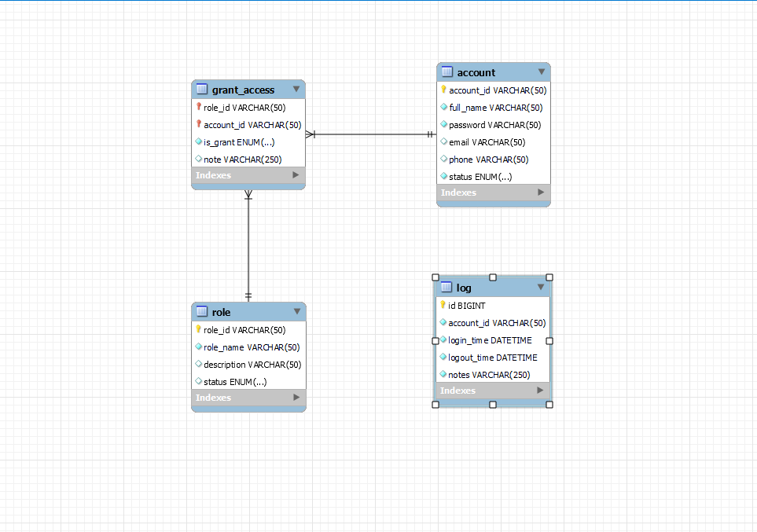
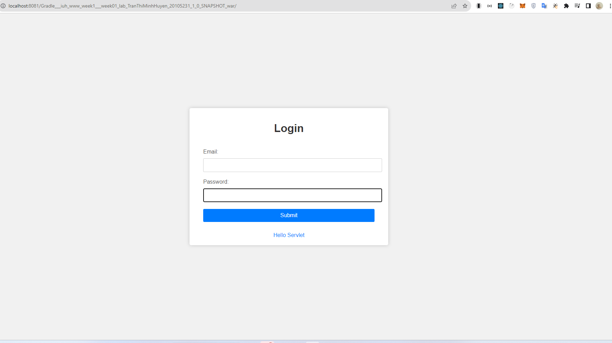
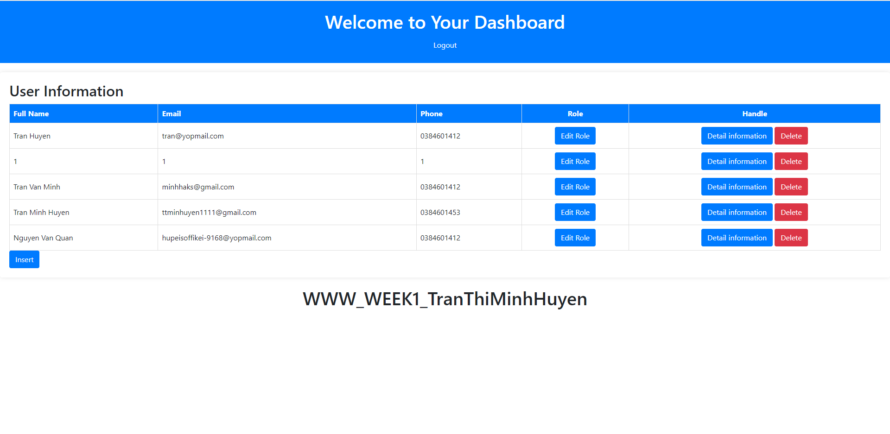
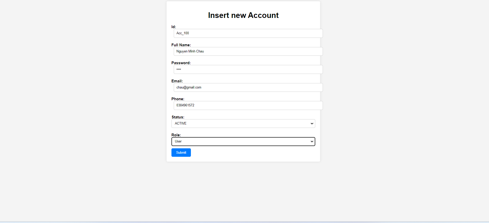
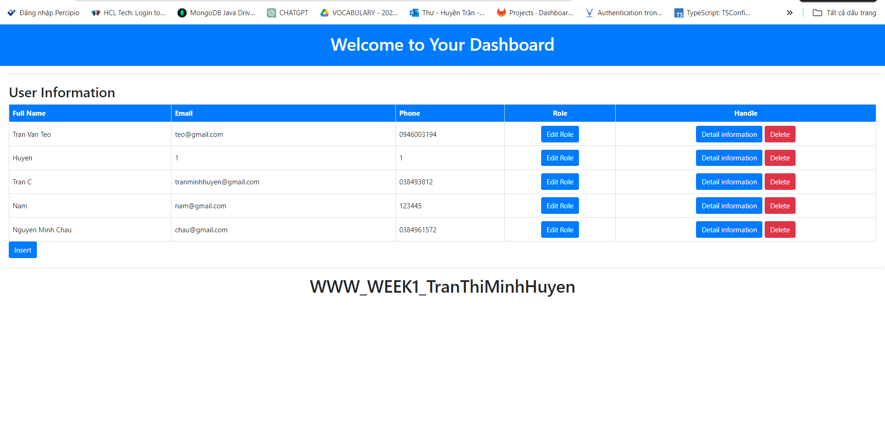
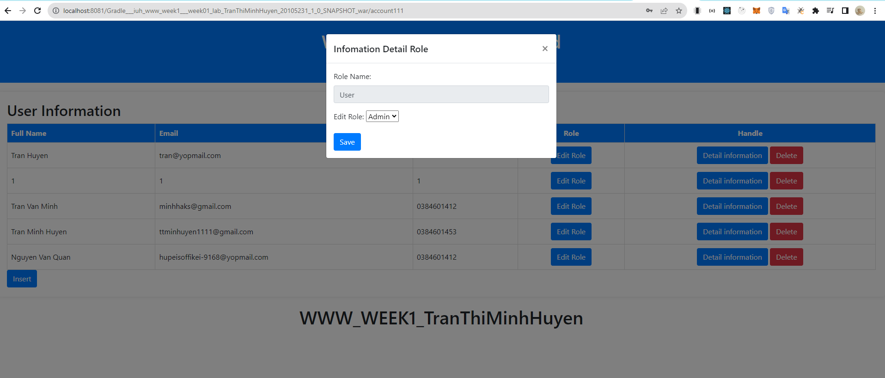
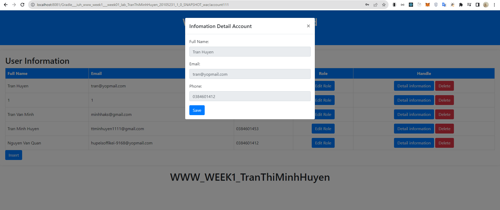
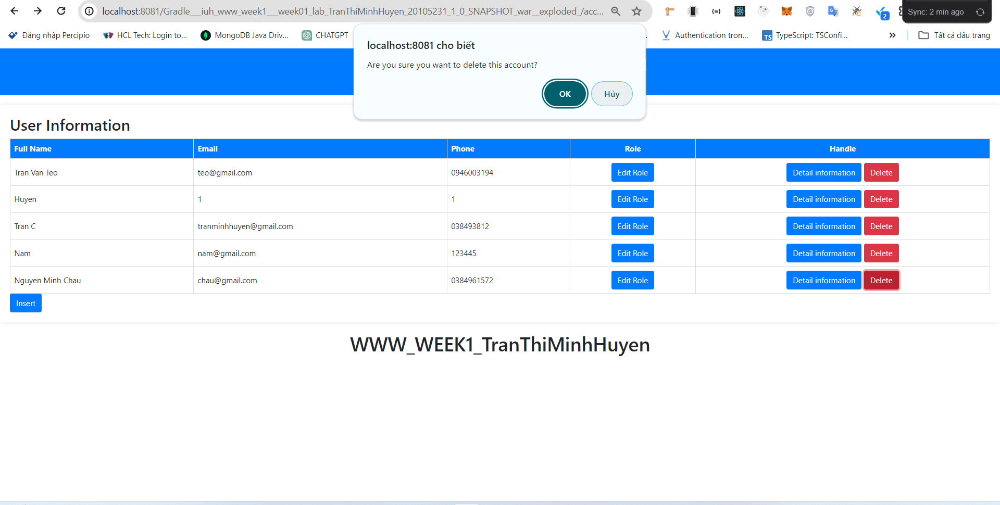

## TranThiMinhHuyen_20105231_WWW
# How to run
- To run program, let's change your port Mariadb or MySQL in file connectDB.
- My computer uses port 3307, it may be different from your computer, so please check and change the port to match mariadb.
- String url = "jdbc:mariadb://localhost:3307/mydb?createDatabaseIfNotExist=true";
# Database diagram

# Rule
- Admin: Insert, edit account, delete, see all list account
- User: Edit information (not edit role), can only view your own information

# UI
1. Login
   
2. Dashboard
   
3. Insert new account
   
   After insert
   
4. Edit role (Only admin can edit role)
   
5. See detail information
   
6. Admin delete account
   
